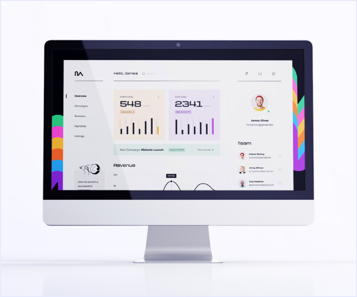

# goit-markup-hw-01-01
<!DOCTYPE html>
<html lang="en">
<head>
    <meta charset="UTF-8">
    <meta http-equiv="X-UA-Compatible" content="IE=edge">
    <meta name="viewport" content="width=device-width, initial-scale=1.0">
    <link rel="stylesheet" href="styles.css">
    <link rel="preconnect" href="https://fonts.googleapis.com">
    <link rel="preconnect" href="https://fonts.gstatic.com" crossorigin>
    <link
    href="https://fonts.googleapis.com/css2?family=Raleway:wght@100;200;300;400;500;600;700;800;900&family=Roboto:wght@100;300;400;500;700;900&display=swap"
    rel="stylesheet">
    <title>WebStudio</title>
</head>
<body class="main_page">
<header class="topline">
    <nav>
        <a class="wstudio" href="">WebStudio</a>
        <ul class="nav">
          <li><a href="">Studio</a></li>
          <li><a href="">Portfolio</a></li>
          <li><a href="">Contacts</a></li>
        </ul>
    </nav>
    <ul>
<li class="cont"><a href="">info@devstudio.com</a></li>
<li class="cont2"><a href="">+ 11 (000) 111-11-11</a></li>
    </ul>
    </header>
    <main>
        <section class="order">
            <h1 class="solut">Effective Solutions for Your Bussines</h1>
            <button class="button" type="button">Order Service</button>
        </section>
        <section class="characteristics">
            <ul>
                <li class="strat">
                    <h3>Strategy</h3>
                    
Our goal is to identify the business
                    problem to walk away with the perfect and creative solution.

                </li>
                <li class="punct">
                    <h3>Punctuality</h3>
                    
Bring the key message to the brand's audience for the best price within the shortest possible time.

                </li>
                <li class="dilig">
                    <h3>Diligence</h3>
                    
Research and confirm brands that present the strongest digital growth opportunities and minimize risk.

                </li>
                <li class="tech">
                    <h3>Technologies</h3>
                    
Design practice focused on digital experiences. We bring forth a deep passion for problem-solving.

                </li>
            </ul>
        </section>
        <section class="wawd">
            <h2 class="wawdteam">What Are We Doing</h2>
            
            
            
        </section>
        <section>
            <h2 class="wawdteam">Our Team</h2>
            
            
            
            
        </section>
        <footer>
            <a class="wstudio" href="">WebStudio</a>
            
Increase the flow of customers and sales for your business with digital marketing & growth solutions.

        </footer>
        </main>
</body>
</html>
